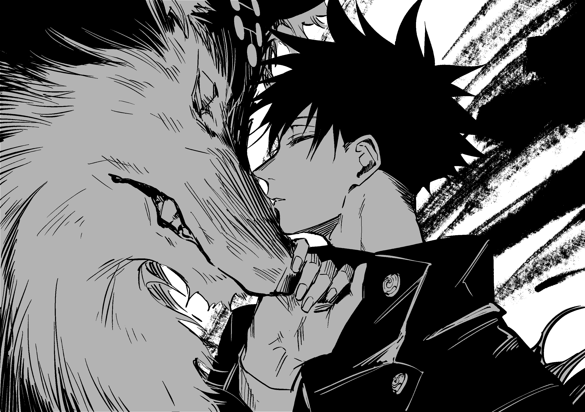

# Jujutsu Kaisen - Scrollytelling Experience

A premium, immersive landing page dedicated to *Jujutsu Kaisen*, featuring complex "Scrollytelling" animations, frame-by-frame canvas rendering, and dynamic transitions. Built as a showcase of advanced frontend design and performance optimization.



## 🌟 Features

*   **Immersive Scroll Animation**: Custom-built frame-by-frame video scrubbing controlled by user scroll, rendering over 400 high-res frames on HTML5 Canvas.
*   **Unified Asset Preloader**: A single, cohesive loading state ("Domain Expansion") that pre-fetches all image sequences for seamless playback.
*   **Advanced GSAP Transitions**:
    *   **Mask Reveal**: Dynamic `clip-path` animations transitioning between the "Void", Gojo, and Sukuna sequences.
    *   **Parallax Effects**: Floating text and depth effects on scroll.
*   **Responsive "GTA 6" Grid**: A dynamic character showcase layout that adapts from a complex bento grid on desktop to a stacked layout on mobile.
*   **Premium Aesthetic**: Curated typography (Oswald, Permanent Marker), micro-interactions, and a cinematic dark theme.

## 🛠️ Tech Stack

*   **Framework**: [Next.js 14](https://nextjs.org/) (App Router)
*   **Styling**: [Tailwind CSS](https://tailwindcss.com/)
*   **Animation**: [GSAP](https://greensock.com/gsap/) (ScrollTrigger, Tween)
*   **Rendering**: HTML5 Canvas (high-performance image sequence rendering)

## 🚀 Getting Started

1.  **Clone the repository**:
    ```bash
    git clone https://github.com/yourusername/jujutsu-kaisen-scroll.git
    cd jujutsu-kaisen-scroll
    ```

2.  **Install dependencies**:
    ```bash
    npm install
    ```

3.  **Run the development server**:
    ```bash
    npm run dev
    ```

4.  Open [http://localhost:3000](http://localhost:3000) with your browser.

## 📱 Responsiveness

The project is fully optimized for all devices:
*   **Desktop**: Full cinematic experience with wide-screen canvas.
*   **Tablet**: Adapted grid layouts and font scaling.
*   **Mobile**: Optimized typography, stacked content, and touch-friendly interactions.

## ⚠️ Disclaimer & Copyright

**This is a non-commercial fan project created solely for educational and portfolio purposes.**

*   All character names, images, and related assets are the property of **Gege Akutami**, **Shueisha**, **MAPPA**, and the **Jujutsu Kaisen Production Committee**.
*   This project is **not affiliated** with or endorsed by the official rights holders.
*   No commercial gain is generated from this site.

## 📄 License

The code is open-source under the [MIT License](LICENSE). The art assets remain under the copyright of their respective owners.
